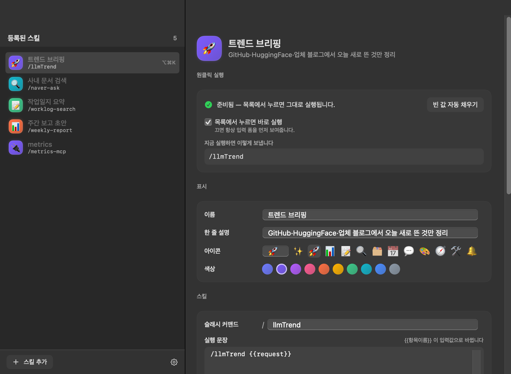

# SkillsOnMenu

[English](README.md)

SkillsOnMenu은 macOS용 **Claude Code skill launcher**이자 **MCP menu-bar
launcher**입니다. 입력값을 추론하고 안전한 기본값을 미리 채워, 사람이 직접 넣어야
할 값이 없으면 카드 한 번으로 실행합니다.


## 왜 SkillsOnMenu인가요?

SkillsOnMenu은 범용 스킬 관리 앱이 아닙니다. 자주 쓰는 Claude Code 스킬과 MCP
워크플로를 메뉴바에서 찾아 즉시 실행하는 화면입니다. 매번 터미널 명령을 다시
조합하지 않아도 됩니다.

제작 배경은 [왜 Claude Code 스킬에 메뉴바 런처가 필요한가](https://blog.dosuser.com/2026/08/19/skills-on-menu-claude-code-skill-launcher-macos.html)에서 읽을 수 있습니다.

## 설치

Homebrew cask는 공개 출시와 함께 `skills-on-menu` 이름으로 전환합니다. 그 전에는
아래처럼 소스에서 빌드할 수 있습니다.

소스에서 빌드하려면 다음을 실행합니다.

```sh
./build.sh
open build/SkillsOnMenu.app
```

## 동작 방식

1. `~/.claude/skills`, `~/.agents/skills`, 플러그인 캐시, Claude 설정에서 스킬과 MCP 서버를 찾습니다.
2. `SKILL.md`의 argument hint, 파라미터 표, `$ARGUMENTS`, 명령 예시로 입력값을 추론합니다.
3. 문서의 기본값과 이름 패턴을 채웁니다. 모든 값이 채워지면 즉시 실행하고, 검색어처럼 사람이 알아야 하는 값만 입력 폼을 엽니다.
4. `claude -p`를 headless로 실행하고 `stream-json` 진행 상황을 보여줍니다.

날짜 등 동적 값은 실행 순간까지 토큰으로 유지합니다. `{{today}}`,
`{{yesterday}}`, `{{thisMonth}}`, `{{home}}` 등을 사용할 수 있습니다.

MCP 서버도 카드로 만들 수 있습니다. 서버 이름·전송 방식·호스트만 읽으며,
`headers`와 `env`는 읽지 않아 API 키가 카드로 복사되지 않습니다.

## 요구 사항

- macOS 14 이상
- Swift 6.1 이상 (Command Line Tools)
- Claude Code CLI: `npm i -g @anthropic-ai/claude-code`

설정은 `~/.config/skillsonmenu/config.json`에 저장됩니다. 기존
`~/.config/skilldock/config.json`이 있으면 첫 실행 때 자동으로 가져와 등록 카드가
유지됩니다.




## 단축키로 스킬 바로 실행

저장한 스킬마다 서로 다른 전역 단축키를 지정할 수 있습니다. 다른 앱을 사용 중이어도
실행할 수 있으며, 일반 타이핑을 가로채지 않도록 수정 키를 포함한 조합만 등록합니다.

| 단축키 | 실행 예시 |
|---|---|
| `⌥⌘T` | Trend Briefing |
| `⌥⌘D` | Document Search |
| `⌥⌘W` | Worklog Summary |
| `⌥⌘R` | Weekly Report Draft |

**스킬 관리 → Keyboard shortcut**에서 각 스킬에 따로 지정합니다.

## 개발 도구

| 명령 | 설명 |
|---|---|
| `tools/selfcheck.sh` | 앱을 띄우지 않고 스킬/MCP 탐색, 입력 추론, 프리필, 토큰 전개 검증 |
| `tools/shots.sh` | 실제 UI를 `docs/images/`에 촬영 |
| `tools/preview.sh` | 빠른 레이아웃 확인 |

## 라이선스

MIT
