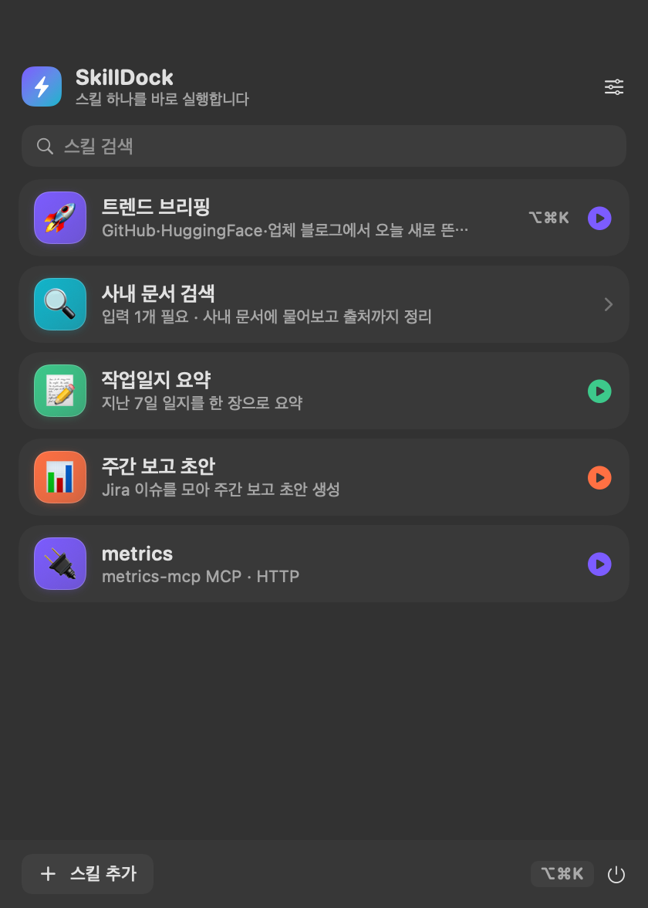

# SkillDock

[English](README.md)

SkillDock은 macOS 메뉴바에서 Claude Code 스킬과 설정된 MCP 서버를 실행하는
런처입니다. 입력값을 추론하고 안전한 기본값을 미리 채워, 사람이 직접 넣어야 할
값이 없으면 카드 한 번으로 실행합니다.



## 설치

```sh
brew tap dosuser/skilldock
brew install --cask skilldock
```

소스에서 빌드하려면 다음을 실행합니다.

```sh
./build.sh
open build/SkillDock.app
```

## 동작 방식

1. `~/.claude/skills`, `~/.agents/skills`, 플러그인 캐시, Claude 설정에서 스킬과 MCP 서버를 찾습니다.
2. `SKILL.md`의 argument hint, 파라미터 표, `$ARGUMENTS`, 명령 예시로 입력값을 추론합니다.
3. 문서의 기본값과 이름 패턴을 채웁니다. 모든 값이 채워지면 즉시 실행하고, 검색어처럼 사람이 알아야 하는 값만 입력 폼을 엽니다.
4. `claude -p`를 headless로 실행하고 `stream-json` 진행 상황을 보여줍니다.

날짜 등 동적 값은 실행 순간까지 토큰으로 유지합니다. `{{today}}`,
`{{yesterday}}`, `{{thisMonth}}`, `{{home}}` 등을 사용할 수 있습니다.

MCP 서버도 카드로 만들 수 있습니다. 서버 이름·전송 방식·호스트만 읽으며,
`headers`와 `env`는 읽지 않아 API 키가 카드로 복사되지 않습니다.

## 요구 사항

- macOS 14 이상
- Swift 6.1 이상 (Command Line Tools)
- Claude Code CLI: `npm i -g @anthropic-ai/claude-code`

설정은 `~/.config/skilldock/config.json`에 저장됩니다.

## 개발 도구

| 명령 | 설명 |
|---|---|
| `tools/selfcheck.sh` | 앱을 띄우지 않고 스킬/MCP 탐색, 입력 추론, 프리필, 토큰 전개 검증 |
| `tools/shots.sh` | 실제 UI를 `docs/images/`에 촬영 |
| `tools/preview.sh` | 빠른 레이아웃 확인 |

## 라이선스

MIT
