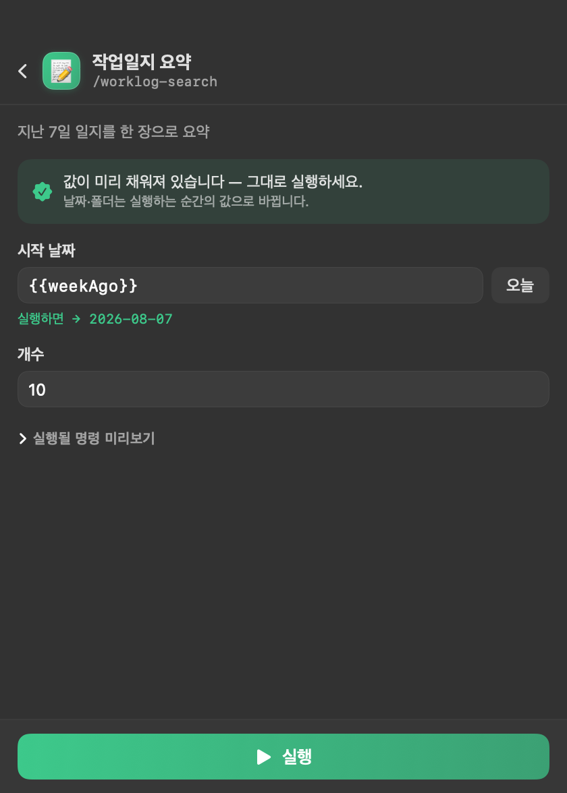
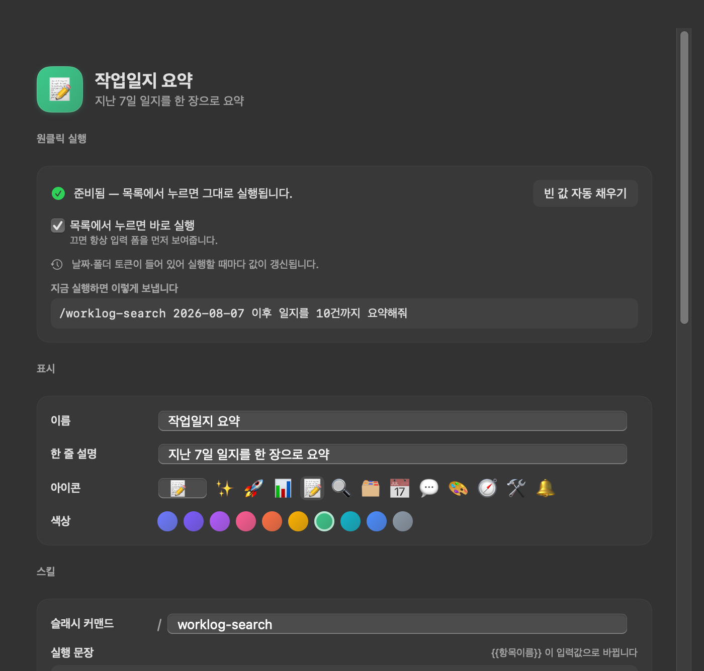
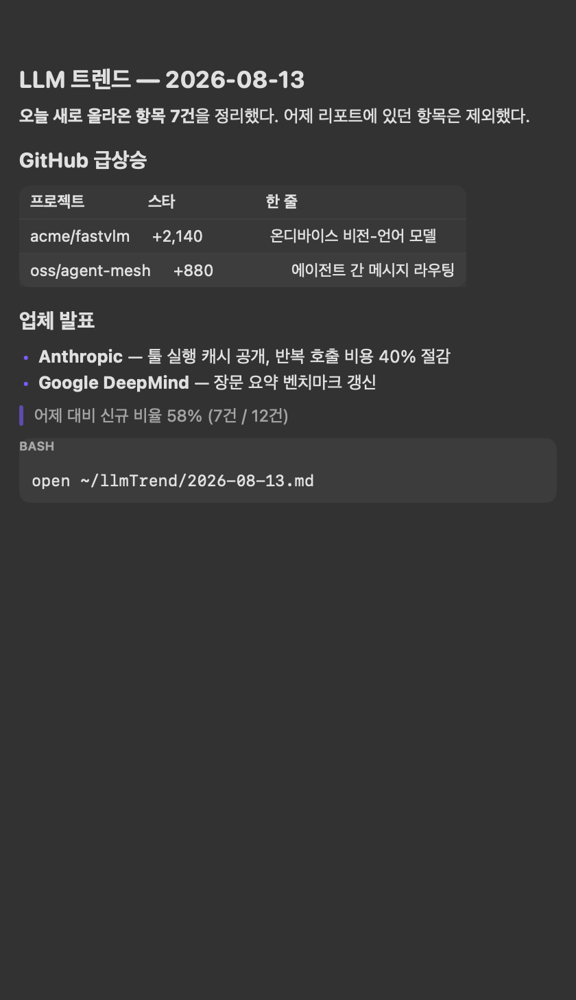

# SkillDock

맥 메뉴바에서 Claude Code 스킬과 MCP 서버를 **버튼 하나로** 실행하는 런처.

값을 미리 채워 두기 때문에 목록에서 카드를 누르는 순간 실행된다. 터미널도, 입력 폼도 거치지 않는다.


위 목록에서 **▶ 표시가 붙은 카드는 누르면 곧바로 실행**된다. 사람만 알 수 있는 값(검색어 등)이 남은 카드만 `입력 1개 필요`로 표시되고 폼이 먼저 열린다.

## 원클릭이 성립하는 방식

| 단계 | 하는 일 |
|---|---|
| 1. 스캔 | `~/.claude/skills`, `~/.agents/skills`, 플러그인 캐시, `~/.claude/commands` 에서 스킬을, `~/.claude.json`·`~/.claude/settings.json` 에서 MCP 서버를 찾는다 |
| 2. 추출 | `SKILL.md` 에서 입력 항목을 뽑는다 (`argument-hint`, 파라미터 표, `$ARGUMENTS`, 예시 명령의 플레이스홀더) |
| 3. **프리필** | 문서에 적힌 예시값(`기본값: 20`, `--env dev`)과 이름 패턴으로 기본값을 채운다. 채워진 항목은 필수에서 내려가 원클릭 대상이 된다 |
| 4. 실행 | `claude -p` 를 headless 로 띄우고 `stream-json` 이벤트를 실시간 로그로 보여준다 |

기본값이 채워진 카드는 폼을 열어도 누를 것만 남는다.



### 날짜는 굳히지 않고 토큰으로 둔다

`2026-08-07` 처럼 날짜를 기본값에 굳혀 두면 하루 뒤엔 틀린 값이 된다. 그래서 프리필은 **토큰**을 넣고 실행하는 순간 펼친다.

| 토큰 | 실행 시 값 |
|---|---|
| `{{today}}` `{{yesterday}}` `{{tomorrow}}` | 오늘·어제·내일 (`yyyy-MM-dd`) |
| `{{weekAgo}}` `{{monthAgo}}` | 7일 전 · 30일 전 |
| `{{thisMonth}}` `{{lastMonth}}` | 이번 달 · 지난 달 (`yyyy-MM`) |
| `{{now}}` `{{year}}` | 지금 시각 · 올해 |
| `{{home}}` `{{desktop}}` `{{downloads}}` `{{documents}}` `{{worklog}}` | 폴더 경로 |

카드 편집 화면은 준비 상태와 **지금 실행하면 보낼 문장**을 그대로 보여준다.



### MCP 서버도 카드가 된다

설정된 MCP 서버를 읽어 `mcp__<서버>__` 도구를 쓰는 카드를 만든다. 요청 문장은 서버 성격에 맞는 **읽기 전용 조회**로 미리 채워지므로, 담고 바로 눌러도 무언가를 망가뜨리지 않는다.

```
mcp__metrics-mcp__ 로 시작하는 MCP 도구를 사용해서
최근 1시간 주요 지표에 이상이 있는지 확인해서 요약해줘. 결과는 표로 정리해줘.
```

서버 설정의 `headers`·`env` 는 **읽지 않는다.** API 키가 카드나 설정 파일로 새지 않도록 이름·전송 방식·호스트만 가져온다.

## 그 밖의 기능

| 기능 | 설명 |
|---|---|
| 전역 단축키 | 카드마다 단축키를 걸어 어디서나 실행한다 (Carbon `RegisterEventHotKey` — 손쉬운 사용 권한 불필요) |
| 실시간 진행 로그 | 도구 호출·중간 텍스트를 그대로 보여준다. 팝오버를 닫아도 실행은 계속된다 |
| 결과 보존 | 결과를 팝오버·macOS 알림·`~/SkillDock/*.md` 세 곳에 남긴다 |
| AI 폼 추출 | 결정적 스캔으로 부족하면 `claude` 에게 `SKILL.md` 를 읽혀 폼과 기본값을 받는다 |



## 요구 사항

- macOS 14 이상 (개발·검증은 macOS 26.3 에서 했다)
- Swift 6.1 이상 — Xcode 없이 **CommandLineTools** 만으로 빌드된다
- **Claude Code CLI** — `npm i -g @anthropic-ai/claude-code`

  > 데스크톱 앱 안의 `~/Library/Application Support/Claude/claude-code-vm/<버전>/claude` 는
  > 샌드박스 VM 용 **리눅스(ELF) 바이너리**라 맥에서 실행되지 않는다. SkillDock 은 이 파일을 실행 후보에서 걸러낸다.

## 빌드

```bash
./build.sh          # swiftc → build/SkillDock.app (ad-hoc codesign)
open build/SkillDock.app
```

Xcode 프로젝트가 없다. `build.sh` 가 `Sources/**` 를 한 번에 컴파일하고 `.app` 번들을 직접 조립한다.

## 개발용 도구

| 명령 | 하는 일 |
|---|---|
| `tools/selfcheck.sh` | 스킬·MCP 스캔, 파라미터 추론, 프리필, 토큰 전개, 프롬프트 렌더링을 앱 없이 검증 |
| `tools/shots.sh` | 오프스크린 창으로 실제 UI 를 PNG 로 촬영 (`docs/images/` 의 그림이 여기서 나온다) |
| `tools/preview.sh` | `ImageRenderer` 기반 빠른 렌더. List·TextField 는 그리지 못하므로 배치 확인용 |

## 구조

```
Sources/
  App/          NSApplication 진입점 (LSUIElement — Dock 아이콘 없음)
  Models/       SkillCard / ParamSpec / AppConfig + config.json 저장소
  Discovery/    스킬 카탈로그, MCP 카탈로그, 파라미터 추론, 프리필·토큰
  Runner/       claude 프로세스 실행 + stream-json 파서 + 알림
  UI/           메뉴바 팝오버, 스킬 관리 창, 마크다운 뷰, 단축키
```

설정은 `~/.config/skilldock/config.json` 하나에 모인다. 앱을 지워도 이 파일만 남기면 그대로 복원된다.

## 라이선스

MIT
