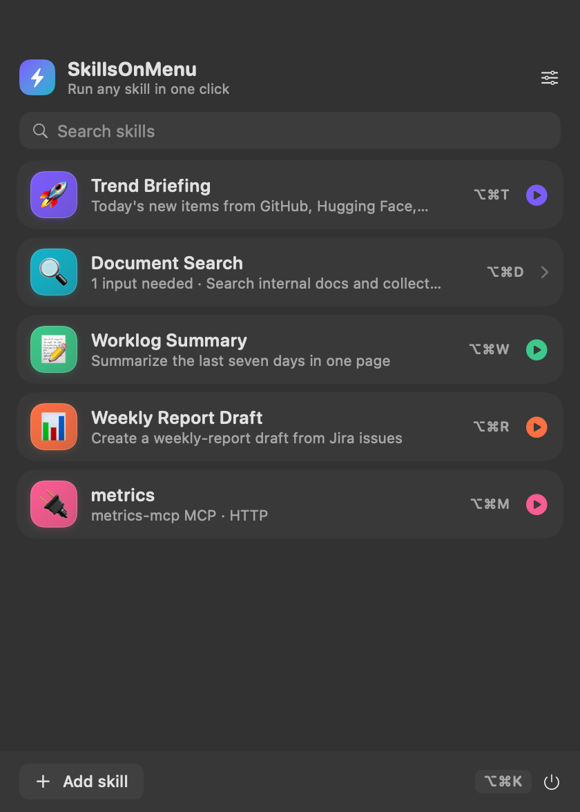
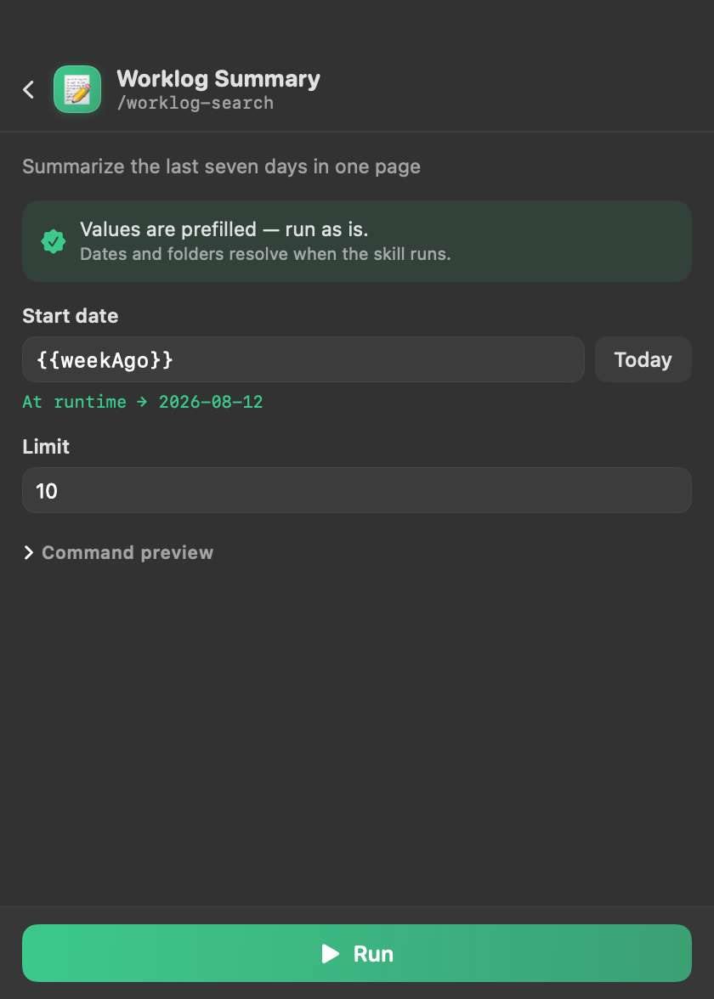
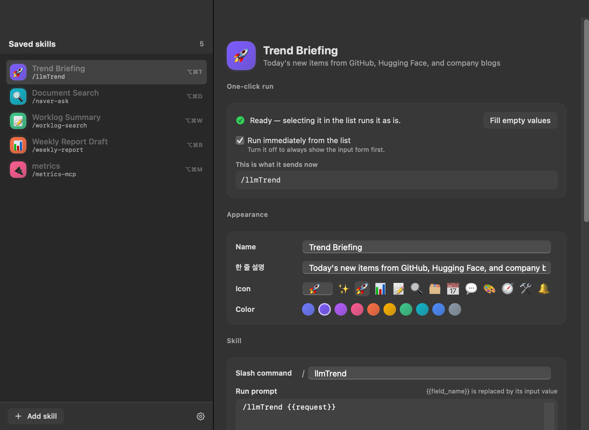

# SkillsOnMenu

[한국어 문서](README.ko.md)

SkillsOnMenu is a **Claude Code skill launcher for macOS** and an **MCP menu-bar
launcher**. It discovers available actions, infers their inputs, fills safe
defaults, and runs them with one click whenever no human-only value is required.



## Why SkillsOnMenu?

SkillsOnMenu is not a general-purpose skill manager. It is the fast execution
surface for recurring Claude Code skills and MCP workflows: open the macOS menu
bar, choose an action, and run it without rebuilding the same terminal command.

Read the design story: [Why a menu-bar launcher for Claude Code skills?](https://blog.dosuser.com/2026/08/19/skills-on-menu-claude-code-skill-launcher-macos.html)

## Install

### Homebrew

```sh
brew tap dosuser/skills-on-menu
brew install --cask skills-on-menu
```

The app is ad-hoc signed and not notarized. The cask removes the quarantine
attribute after installation. Upgrade with `brew upgrade --cask skills-on-menu`
and remove with `brew uninstall --cask skills-on-menu` (`--zap` also removes
settings).

### Build from source

```sh
./build.sh
open build/SkillsOnMenu.app
```

No Xcode project is required. `build.sh` compiles `Sources/**`, creates the app
bundle, and ad-hoc signs it.

## How it works

1. **Discover** skills from `~/.claude/skills`, `~/.agents/skills`, plugin caches,
   and `~/.claude/commands`; discover MCP servers from Claude settings.
2. **Infer inputs** from `SKILL.md`, argument hints, parameter tables, `$ARGUMENTS`,
   and command examples.
3. **Prefill** documented defaults and name-based defaults. A fully resolved card
   runs directly; unresolved human values open a small form.
4. **Run** `claude -p` headlessly and show `stream-json` progress in real time.

Dynamic values stay as tokens until execution, so a date never becomes stale:

| Token | Value at runtime |
|---|---|
| `{{today}}`, `{{yesterday}}`, `{{tomorrow}}` | Dates (`yyyy-MM-dd`) |
| `{{weekAgo}}`, `{{monthAgo}}` | 7 or 30 days ago |
| `{{thisMonth}}`, `{{lastMonth}}` | Months (`yyyy-MM`) |
| `{{now}}`, `{{year}}` | Current time or year |
| `{{home}}`, `{{desktop}}`, `{{downloads}}`, `{{documents}}`, `{{worklog}}` | Local paths |

MCP servers become cards too. SkillsOnMenu reads only server name, transport, and
host—never `headers` or `env` values—so API keys are not copied into cards.

## Features

- Global shortcuts using Carbon `RegisterEventHotKey`
- Live tool-call and text progress
- Results retained in the popover, macOS notifications, and `~/SkillsOnMenu/*.md`
- Card editing for name, color, shortcut, and run options
- Optional AI form inference when deterministic parsing is insufficient





## Keyboard shortcuts

Assign a different global shortcut to every saved skill, then run it from any
app. SkillsOnMenu registers the shortcuts with macOS, so the menu bar does not
have to be open. Modifier keys are required to avoid intercepting normal typing.

| Shortcut | Example action |
|---|---|
| `⌥⌘T` | Trend Briefing |
| `⌥⌘D` | Document Search |
| `⌥⌘W` | Worklog Summary |
| `⌥⌘R` | Weekly Report Draft |

Set each shortcut in **Skill Manager → Keyboard shortcut**. The screenshot above
shows separately assigned shortcuts beside the saved skills.

## Requirements

- macOS 14 or newer
- Swift 6.1+ via Command Line Tools
- [Claude Code CLI](https://docs.anthropic.com/en/docs/claude-code):
  `npm i -g @anthropic-ai/claude-code`

SkillsOnMenu ignores the Linux ELF binary bundled inside the Claude desktop app;
install the native macOS Claude Code CLI instead.

## Development tools

| Command | Purpose |
|---|---|
| `tools/selfcheck.sh` | Verify discovery, inference, prefilling, token expansion, and prompt rendering without launching the app |
| `tools/shots.sh` | Capture the actual UI to `docs/images/` |
| `tools/preview.sh` | Fast `ImageRenderer` layout preview |

## Project layout

```text
Sources/
  App/        App entry point (menu-bar only)
  Models/     Cards, parameters, and configuration storage
  Discovery/  Skill and MCP discovery, inference, prefilling
  Runner/     Claude process execution, stream parsing, notifications
  UI/         Popover, library window, Markdown, hotkeys
```

Configuration is stored in `~/.config/skillsonmenu/config.json` and survives app
reinstallation. On first launch, SkillsOnMenu imports the previous
`~/.config/skilldock/config.json` file when present, so saved cards are retained.

## License

MIT
